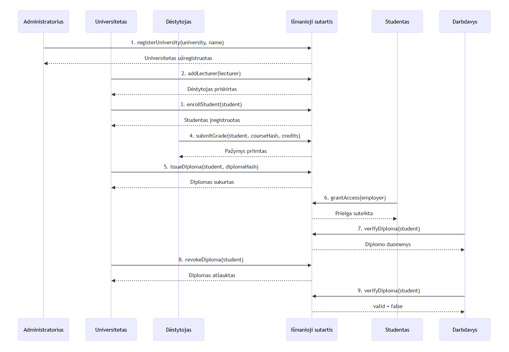
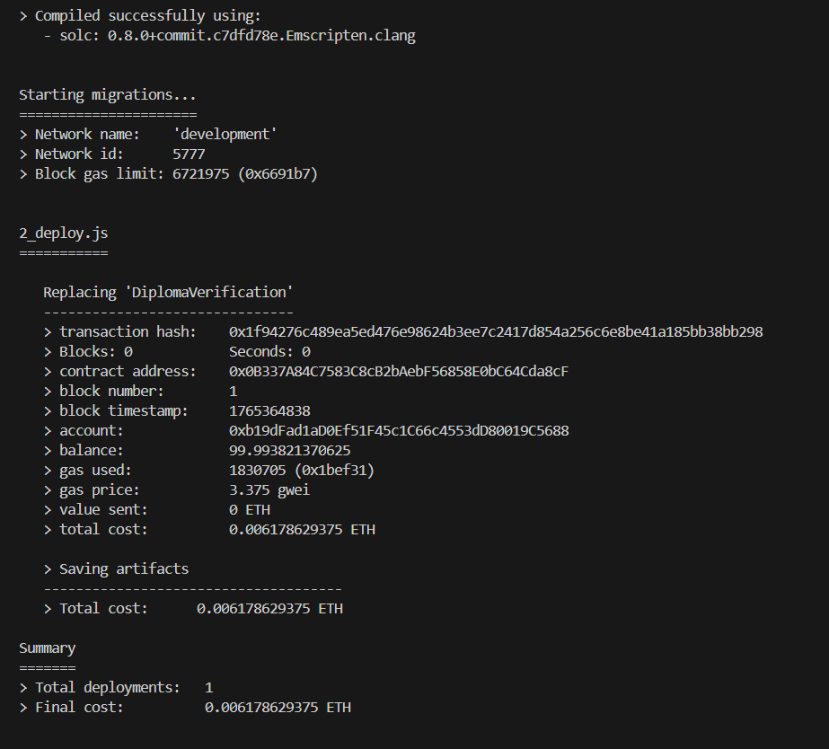
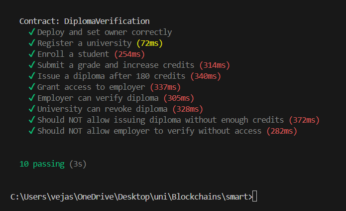
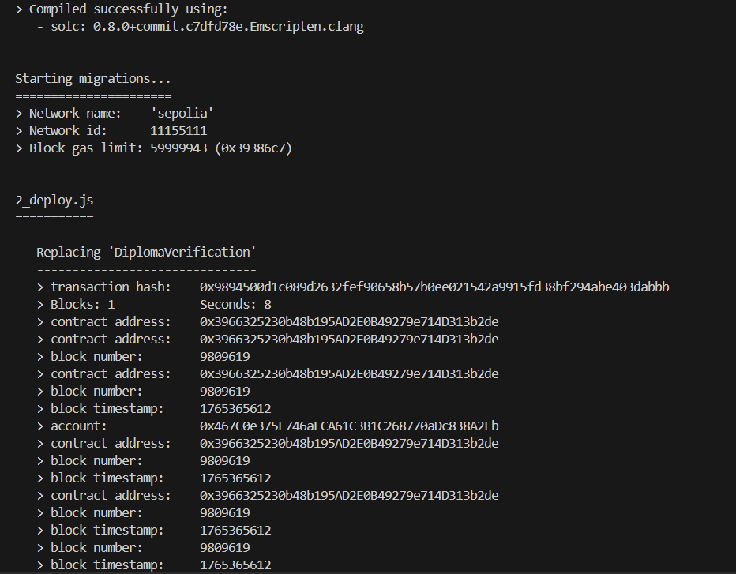
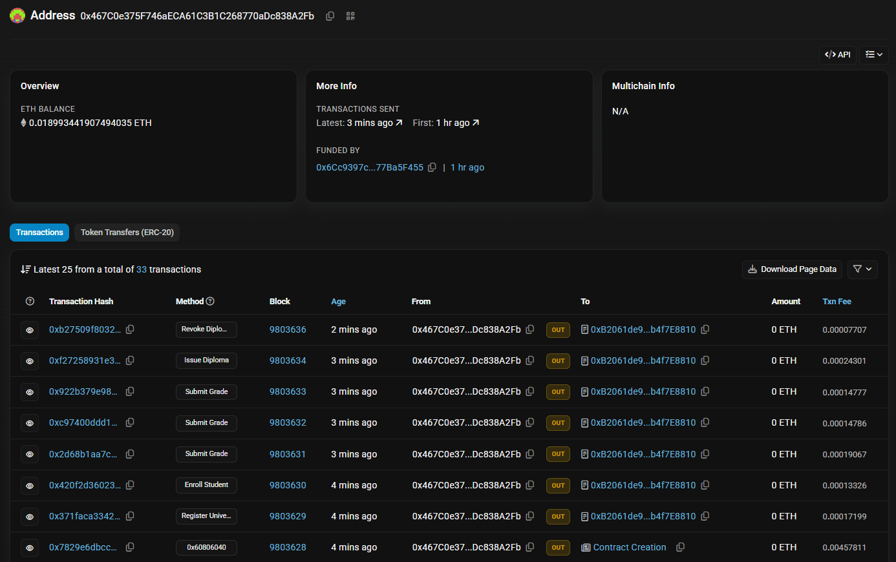
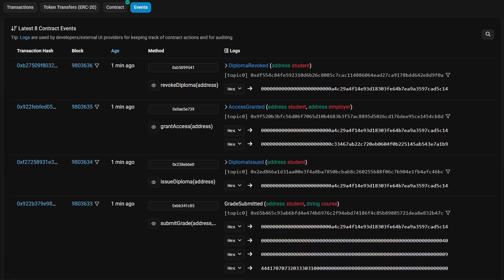

# Išmaniosios sutarties ir decentralizuotos aplikacijos kūrimas

## Decentralizuota universiteto diplomų ir kvalifikacijų patikra

--- 

#### Verslo problema, kurią sprendžia sistema
##### Tradicinėje sistemoje:
* Diplomai ir pažymėjimai gali būti klastojami
* Darbdaviai priversti rankiniu būdu tikrinti dokumentus
* Universitetai patiria didelę administracinę naštą
* Duomenys saugomi centralizuotai, todėl gali būti pažeidžiami

##### Blockchain sprendimas leidžia:
* Užtikrinti duomenų nekintamumą
* Užtikrinti diplomų patikrą decentralizuotu būdu be tarpininkų
* Sumažinti biurokratiją
* Padidinti pasitikėjimą tarp visų šalių

---

### Verslo modelio logika

Sistema veikia kaip decentralizuotas akademinių kvalifikacijų registras, kuriame:
* Universitetai ir dėstytojai yra duomenų teikėjai
* Studentai yra duomenų savininkai
* Darbdaviai yra duomenų tikrintojai
* Išmanioji sutartis veikia kaip nepriklausomas pasitikėjimo garantas

Visi įrašai:
* Yra laiko žymėti
* Yra patikrinami
* Negali būti pakeisti ar ištrinti
* Yra pasiekiami tik su atitinkamomis teisėmis

---
### Pagrindiniai sistemos veikėjai

#### Universitetas
* Registruoja studijų programas
* Tvirtina studentų akademinius rezultatus
* Išduoda diplomus per išmaniąją sutartį
* Veikia kaip oficialus duomenų šaltinis

#### Dėstytojas
* Suveda studentų kurso rezultatus
* Patvirtina įvykdytas studijų dalis
* Priklauso konkrečiam universitetui

#### Studentas
* Yra akademinių duomenų savininkas
* Gali matyti visą savo studijų istoriją
* Gali suteikti prieigą darbdaviui prie savo įrašų

#### Darbdavys
* Tikrina diplomų ir kvalifikacijų autentiškumą
* Neturi galimybės keisti duomenų
* Gali tikrinti tik gavęs studento leidimą

#### Išmanioji sutartis
* Saugo akademinių įrašų „hash“
* Užtikrina duomenų nekintamumą
* Tikrina naudotojų teises
* Automatizuoja visus patvirtinimo procesus

---
### Tipiniai sistemos veikimo scenarijai

#### 1. Universiteto registracija sistemoje
**Dalyviai:** Universitetas, Išmanioji sutartis  
1. Universitetas iškviečia funkciją `registerUniversity()`
2. Išmanioji sutartis patikrina, ar adresas dar neregistruotas
3. Universitetui suteikiamas oficialus statusas
4. Nuo šiol jis gali registruoti studentus ir tvirtinti pažymius

---

#### 2. Studento registracija į studijų programą
**Dalyviai:** Universitetas, Studentas, Išmanioji sutartis  
1. Universitetas iškviečia `enrollStudent()`
2. Studentui priskiriama studijų programa
3. Studentas įtraukiamas į sistemos duomenų bazę

---

#### 3. Kurso rezultato pateikimas
**Dalyviai:** Dėstytojas, Išmanioji sutartis  
1. Dėstytojas pateikia pažymį per `submitGrade()`
2. Išmanioji sutartis patikrina:
   * Ar dėstytojas turi teisę įvesti pažymį
   * Ar studentas priklauso šiam universitetui
3. Pažymys įrašomas į blokų grandinę

---

#### 4. Diplomo išdavimas
**Dalyviai:** Universitetas, Studentas, Išmanioji sutartis  
1. Sistema patikrina, ar visi kursai yra išlaikyti
2. Universitetas iškviečia `issueDiploma()`
3. Studentui priskiriamas skaitmeninis diplomas
4. Diplomo būsena pažymima kaip „Galiojantis“

---

#### 5. Prieigos suteikimas darbdaviui
**Dalyviai:** Studentas, Darbdavys, Išmanioji sutartis  
1. Studentas iškviečia `grantAccess()`
2. Darbdaviui suteikiama laikina prieiga prie duomenų
3. Darbdavys gali peržiūrėti tik leistiną informaciją

---

#### 6. Diplomo autentiškumo tikrinimas
**Dalyviai:** Darbdavys, Išmanioji sutartis  
1. Darbdavys iškviečia `verifyDiploma()`
2. Patikrinama:
   * Ar diplomas išduotas registruoto universiteto
   * Ar nebuvo atšauktas
   * Ar nėra pakeistas
3. Grąžinamas patvirtinimo rezultatas

---

#### 7. Diplomo atšaukimas
**Dalyviai:** Universitetas, Išmanioji sutartis  
1. Universitetas inicijuoja `revokeDiploma()`
2. Diplomo būsena pakeičiama į „Atšauktas“
3. Bet kokia vėlesnė patikra rodys nebegaliojantį diplomą

---

### Verslo modelio sekų diagrama

---

### Sekos veiksmų aprašymas

1. **Universiteto registracija**  
   Universitetas įdiegia ir užregistruoja savo adresą išmaniojoje sutartyje. Nuo šio momento jis turi teisę tvirtinti studentus ir išduoti diplomus.

2. **Studento įregistravimas**  
   Universitetas įtraukia studentą į studijų programą. Studentas tampa oficialiu sistemos dalyviu.

3. **Pažymių įvedimas**  
   Dėstytojas suveda studento kurso rezultatą. Išmanioji sutartis patikrina dėstytojo teises ir išsaugo pažymį.

4. **Kreditų patvirtinimas**  
   Universitetas patikrina, ar studentas surinko reikiamą kreditų skaičių studijų programai baigti.

5. **Diplomo išdavimas**  
   Universitetas iškviečia diplomo išdavimo funkciją. Išmanioji sutartis sukuria skaitmeninį diplomą ir priskiria jį studentui.

6. **Prieigos suteikimas darbdaviui**  
   Studentas suteikia darbdaviui teisę peržiūrėti savo diplomą ir kvalifikacijas.

7. **Diplomo patikra**  
   Darbdavys patikrina, ar diplomas yra galiojantis ir išduotas registruoto universiteto.

8. **Diplomo atšaukimas**  
   Universitetas, esant teisėtam pagrindui, atšaukia diplomą (pvz., dėl nustatyto sukčiavimo).

9. **Pakartotinė patikra po atšaukimo**  
   Darbdavys pakartotinai tikrina diplomą ir gauna informaciją, kad diplomas nebegalioja.

10. **Procesas uždaromas**  
    Išmanioji sutartis užfiksuoja galutinę diplomo būseną blokų grandinėje.

---

### Testavimas Ethereum lokaliame tinkle
* ``2_deploy.js`` - faile apibrėžiama, kaip ir kurios išmaniosios sutartys diegiamos
* ``truffle-config.js`` - konfigūruoja patį Truffle, tinklo nustatymus, pinigines
#### Paleidimas ir testavimas lokaliame tinkle
* 
`` 
truffle compile
``
``
truffle migrate --network development
``

``
truffle test
``

### Testavimas Sepolia tinkle

1. Sukonfigūravau MetaMask piniginę ir prijungiau ją prie Sepolia testinio tinklo  
2. Gavau test ETH iš Sepolia faucet (iš ``https://sepolia-faucet.pk910.de/#/``)  
3. Sukonfigūravau `truffle-config.js` su Alchemy ir MetaMask mnemonika  
4. Deploy’inau išmaniąją sutartį į Sepolia tinklą `truffle migrate --network sepolia` 
5. Paleidau testavimą `node test/sepolia_test.js` 
6. Patikrinau transakcijas ir event logus Etherscan svetainėje

---

### Paleidimas
* ``truffle migrate --network sepolia``
* ``truffle exec test/sepolia_test.js --network sepolia``

