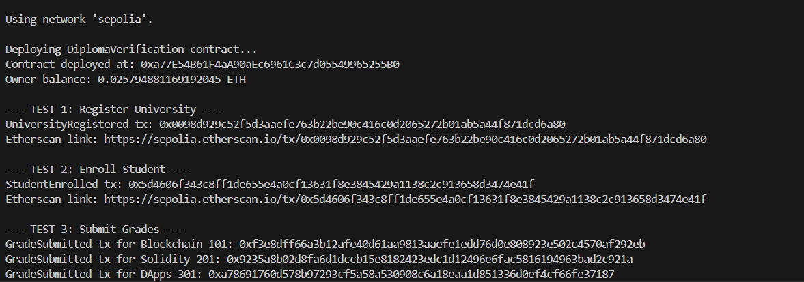

# Išmaniosios sutarties ir decentralizuotos aplikacijos kūrimas

## Decentralizuota universiteto diplomų ir kvalifikacijų patikra

--- 

#### Verslo problema, kurią sprendžia sistema
##### Tradicinėje sistemoje:
* Diplomai ir pažymėjimai gali būti klastojami
* Darbdaviai priversti rankiniu būdu tikrinti dokumentus
* Universitetai patiria didelę administracinę naštą
* Duomenys saugomi centralizuotai, todėl gali būti pažeidžiami

##### Blockchain sprendimas leidžia:
* Užtikrinti duomenų nekintamumą
* Užtikrinti diplomų patikrą decentralizuotu būdu be tarpininkų
* Padidinti pasitikėjimą tarp visų šalių

---

### Verslo modelio logika

Sistema veikia kaip decentralizuotas akademinių kvalifikacijų registras, kuriame:
* Universitetai ir dėstytojai yra duomenų teikėjai
* Studentai yra duomenų savininkai
* Darbdaviai yra duomenų tikrintojai
* Išmanioji sutartis veikia kaip nepriklausomas pasitikėjimo garantas

Visi įrašai:
* Yra laiko žymėti
* Yra patikrinami
* Negali būti pakeisti ar ištrinti
* Yra pasiekiami tik su atitinkamomis teisėmis

---
### Sistemos dalyviai

#### Admin
* Registruoja universitetus

#### Universitetas
* Registruoja dėstytojus
* Registruoja studentus
* Išduoda diplomus per išmaniąją sutartį
* Veikia kaip oficialus duomenų šaltinis

#### Dėstytojas
* Suveda studentų kurso rezultatus
* Priklauso konkrečiam universitetui

#### Studentas
* Gali matyti visą savo studijų istoriją
* Gali suteikti prieigą darbdaviui prie savo įrašų

#### Darbdavys
* Tikrina diplomų autentiškumą
* Neturi galimybės keisti duomenų
* Gali tikrinti tik gavęs studento leidimą

#### Išmanioji sutartis
* Užtikrina duomenų nekintamumą
* Tikrina naudotojų teises
* Palengvina visus patvirtinimo procesus

---
### Tipiniai sistemos scenarijai

#### 1. Universiteto registracija sistemoje
**Dalyviai:** Admin, Išmanioji sutartis  
1. Administratorius iškviečia funkciją `registerUniversity(universityAddress, name)`
2. Išmanioji sutartis patikrina, ar adresas dar neregistruotas
3. Universitetui suteikiamas statusas

---

#### 2. Dėstytojo priskyrimas universitetui
**Dalyviai:** Universitetas, Išmanioji sutartis  
1. Universitetas iškviečia `addLecturer(lecturerAddress)`
2. Patikrina, ar kviečiantis adresas yra universitetas
3. Dėstytojas pridedamas prie universiteto

---

#### 3. Studento įregistravimas į universitetą
**Dalyviai:** Universitetas, Išmanioji sutartis  
1. Universitetas iškviečia enrollStudent(studentAddress)
2. Sutartis patikrina, ar universitetas registruotas ir ar studentas dar neįregistruotas
3. Studentas pridedamas

---

#### 4. Kurso rezultato pateikimas
**Dalyviai:** Dėstytojas, Išmanioji sutartis  
1. Dėstytojas pateikia pažymį per `submitGrade()`
2. Išmanioji sutartis patikrina:
   * Ar dėstytojas turi teisę įvesti pažymį
   * Ar studentas priklauso dėstytojo universitetui
3. Kreditai įrašomi

---

#### 4. Diplomo išdavimas
**Dalyviai:** Universitetas, Studentas, Išmanioji sutartis  
1. Universitetas iškviečia `issueDiploma(student, diplomaHash)`
2. Sutartis patikrina ar 
* kviečia registruotas universitetas
* studentas priklauso kviečiančiam universitetui
* surinkta ≥ 180 kreditų
* studentas dar neturi diplomo
3. Studentui priskiriamas diplomas
4. Diplomo būsena pažymima kaip „Galiojantis“

---

#### 5. Prieigos suteikimas darbdaviui
**Dalyviai:** Studentas, Darbdavys, Išmanioji sutartis  
1. Studentas iškviečia `grantAccess(employer)`
2. Darbdaviui suteikiama laikina prieiga prie duomenų
3. Darbdavys gali peržiūrėti tik leistiną informaciją

---

#### 6. Diplomo tikrinimas
**Dalyviai:** Darbdavys, Išmanioji sutartis  
1. Darbdavys iškviečia `verifyDiploma()`
2. Patikrinama:
   * Ar diplomas išduotas registruoto universiteto
   * Ar nebuvo atšauktas
3. Grąžinamas patvirtinimo rezultatas

---

#### 7. Diplomo atšaukimas
**Dalyviai:** Universitetas, Išmanioji sutartis  
1. Universitetas inicijuoja `revokeDiploma()`
2. Diplomo būsena pakeičiama į „Atšauktas“
3. Bet kokia vėlesnė patikra rodys nebegaliojantį diplomą

---

### Verslo modelio sekų diagrama

---

### Sekos veiksmų aprašymas

1. **Universiteto registracija**  
   Sistemos administratorius užregistruoja universitetą išmaniojoje sutartyje.

2. **Dėstytojo įregistravimas**  
   Universitetas įtraukia dėstytoja į universitetą

3. **Studento įregistravimas**  
   Universitetas įtraukia studentą į universitetą

4. **Pažymių įvedimas**  
   Dėstytojas suveda studento kurso rezultatą. Išmanioji sutartis patikrina dėstytojo teises ir prideda studentui kreditus

5. **Diplomo išdavimas**  
   Universitetas išduoda diplomą studentui, kai surenkamas reikiamas kreditų skaičius. Sutartyje išsaugomas diplomo hashas.

6. **Prieigos suteikimas darbdaviui**  
   Studentas suteikia darbdaviui teisę peržiūrėti savo diplomo duomenis.

7. **Diplomo patikra**  
   Darbdavys patikrina diplomo galiojimą ir autentiškumą išmaniojoje sutartyje.

8. **Diplomo atšaukimas**  
   Universitetas atšaukia diplomą.

9. **Pakartotinė patikra po atšaukimo**  
   Darbdavys pakartotinai tikrina diplomą ir gauna informaciją, kad diplomas nebegalioja.

---

### Testavimas Ethereum lokaliame tinkle
* ``2_deploy.js`` - faile apibrėžiama, kaip ir kurios išmaniosios sutartys diegiamos
* ``truffle-config.js`` - konfigūruoja patį Truffle, tinklo nustatymus, pinigines
#### Paleidimas ir testavimas lokaliame tinkle
`` 
* truffle compile
``
``
* truffle migrate --network development
``

``
* truffle test
``

---

### Testavimas Sepolia tinkle

1. Sukonfigūravau MetaMask piniginę ir prijungiau ją prie Sepolia testinio tinklo  
2. Gavau test ETH iš Sepolia faucet (iš ``https://sepolia-faucet.pk910.de/#/``)  
3. Sukonfigūravau `truffle-config.js` su Alchemy ir MetaMask mnemonika  
4. Deploy’inau išmaniąją sutartį į Sepolia tinklą `truffle migrate --network sepolia` 
5. Paleidau sepolia testą `test/sepolia_test.js` 
6. Patikrinau transakcijas ir event logus Etherscan svetainėje

### Paleidimas
* ``truffle migrate --network sepolia``
* ``truffle exec test/sepolia_test.js --network sepolia``

